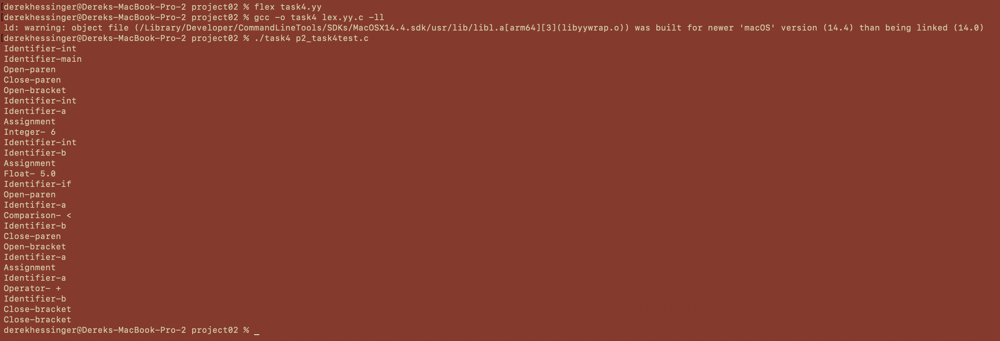

# Project 2
Derek Hessinger

## Google Sites Link
https://sites.google.com/colby.edu/dereks-cs333-site/home

## Tree
```
.
├── README.md
├── c
│   ├── lex.yy.c
│   ├── p2_html-multi-line_comm_test.txt
│   ├── p2_htmltest.txt
│   ├── p2_htmltest2.txt
│   ├── p2_task4test.c
│   ├── task1.yy
│   ├── task2.txt
│   ├── task2.yy
│   ├── task3.yy
│   └── task4.yy
├── c++
│   └── part2_c++.cpp
├── media
│   ├── p2task3_1.png
│   ├── p2task3_2.png
│   ├── p2task3_3.png
│   ├── p2task4.png
│   ├── proj2_task1.png
│   └── proj2_task2.png
└── ocaml
    └── part2_ocaml.ml
```

## Operating System and C Compiler
OS: Apple Sonoma \
C compiler: Apple clang version 15.0.0 (clang-1500.3.9.4), Target: arm64-apple-darwin23.5.0, Thread model: posix

## Task 1
This file can be run with the following commands:  
```
flex task1.yy
gcc -o task1 lex.yy.c -ll
./task1 {put letter(s) here}
```

My flex code begins by first establishing macros for uppercase and lowercase letters. This is because uppercase letters range from 65-90 in ASCII values, whereas lowercase letters range from 97-122. In the rules section, both the lowercase and uppercase letters are shifted forward 13 letters. This is done by accessing the letter with `*yytext`, subtracting either 'a' or 'A' depending on if the letter is upper or lower cased, then adding 13 and taking the modulus of 26 of that sum, finallly adding either 'a' or 'A' back to get the correct ASCII value.  
To see how this works, consider an input string of "c". The char "c" has an ASCII value of 99. Therefore, 99-'a', or 99-97 = 2. Adding 13, 2+13=15. The modulus of this is 15%26=15. Finally, adding 'a' again, 15+97=112. The ASCII value of 112 is 'p', which is 13 letters ahead of 'c'.   
As seen below, the program takes in the phrase "Test Input", outputs the string's chars shifted forward 13. When putting the output back into the program, it returns the original string "Test Input", showing that the program works successfully.


## Task 2
This file can be run with the following commands:  
```
flex task2.yy
gcc -o task2 lex.yy.c -ll
./task2 {enter txt file here}
```
My flex code begins by first defining variables to track the number of appearances for each vowel individually, the number of rows, and the total number of chars. Then, in the rules section of the flex file, I increment the counter for each respective vowel when one is encountered, capitalized or lowercase, as well as the counter for the total number of chars. Upon a newline character, I increase the counter for the number of rows, along with the counter for the total number of chars. Finally, for any other character encountered I increase the counter for the total number of chars. In the user code section of the file, I printed out the number of occurances for each vowel, the total number of rows, and the total number of chars.   
An example of how one letter is counted is on an input where the character is "e". Here, the program picks up the letter "e" from the rule defined on line 21, `[Ee] {count_e++; count++;}`. Thus, the counter for "e" is increased, along with the counter for all chars in the file.  
Below is an image that demonstrates that my program runs as desired. The terminal output shows the file that I pass to my program, before calling `flex task2.yy`, `gcc -o task2 lex.yy.c -ll`, then `./task2 task2.txt`. By manually counting all of the vowels, characters, and lines, I was able to confirm that the output of the program matches the contents of the file, and therefore works as desired.


## Task 3
This file can be run with the following commands:  
```
flex task3.yy
gcc -o task3 lex.yy.c -ll
./task3 {enter html txt file here}
```
The code I wrote for this program begins in the rules section, where first the program removes extraneous whitespace from the document. The regex statement `[ \t\n]+`, where the program looks for one or more occurances of tabs and newlines, and removes them. The next lines each put in newline characters for header, title, list, and paragraph tags. They do so by matching the literal strings, except in the case for headers where some regex is needed to specify the range of possible number values for the header. The final line in the rules section, `"<"[^<>]+">"` removes all other tags and comments from the text.  
An example of how one particular tag is handled is the `<body>` tag. Since it doesnt fit into the any of the explicit tag rules defined by my program, it falls into the final rule for tags, `\<[^<>]+\>`, which removes the tag and replaces it with whitespace. In this example, the `<body>` tag would be replaced with whitespace.  
Pictures of the the outputs from running the program on the two example files can be seen below:


## Task 4
This file can be run with the following commands:  
```
flex task4.yy
gcc -o task4 lex.yy.c -ll
./task4 {enter clite file here}
```
The code I wrote for this task begins first by defining `DIGIT  [0-9]` in the definitions section of the code, in order to reference digits later in the rules. In the rules section, each respective type is defined as its own rule, where the type is printed out, and for ones with variance such as identifiers, floats, ints, keywords, comparisons, and operators, the one that is used is printed out with the type.  
An example of how the code works is when it encounters a float like 1.0. Since the pattern matches the float rule `{DIGIT}+"."{DIGIT}*` because it has a digit, then period, then digit, the program then classifies it as a float and prints out `Float- 1.0`.  
The picture below shows the program being compiled and run with the example file provided for the project:


## Extensions
For my extensions, I looked into a second language, OCaml. To run the OCaml file, you can use the following commands:  
```
ocaml -o part2_ocaml part2_ocaml.ml
./part2_ocaml
```